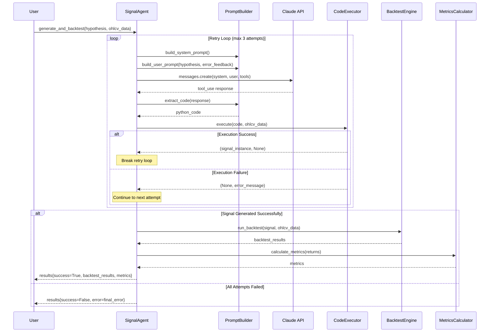
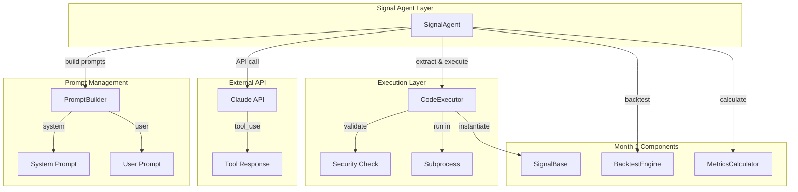
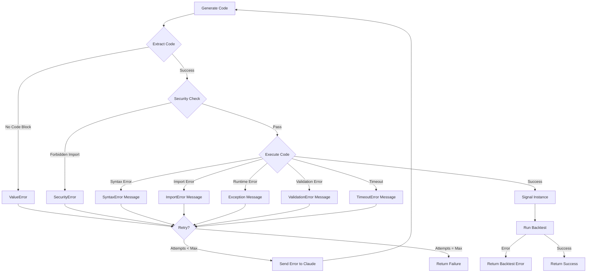

# Design Document: Claude Signal Agent

## Overview

The Claude Signal Agent is an AI-powered code generation system that transforms natural language trading hypotheses into executable Python signal implementations. It orchestrates a complete workflow: prompt construction → Claude API interaction → code extraction → sandboxed execution → error feedback retry loop → backtesting → metrics calculation.

The system consists of three core components:

1. **PromptBuilder**: Constructs system and user prompts for Claude API, including SignalBase interface specifications, examples, and error feedback formatting
2. **CodeExecutor**: Provides sandboxed subprocess execution with security restrictions, timeout enforcement, and comprehensive error handling
3. **SignalAgent**: Orchestrates the full workflow with retry logic, Claude API integration, and backtest execution

The agent integrates with the existing Month 1 BacktestEngine and MetricsCalculator to provide complete hypothesis-to-results automation.

## Architecture

### Component Interaction Flow



### System Architecture



## Components and Interfaces

### PromptBuilder

The PromptBuilder constructs all prompts for Claude API interaction and extracts code from responses.

```python
class PromptBuilder:
    """
    Constructs prompts for Claude API and extracts code from responses.
    """
    
    def build_system_prompt(self) -> str:
        """
        Build system prompt with SignalBase interface and instructions.
        
        Returns:
            System prompt string containing:
            - Role description (quantitative signal writer)
            - SignalBase interface specification
            - Example implementation (MomentumSignal)
            - Valid signal values {-1, 0, 1}
            - Index requirements (DatetimeIndex matching input)
            - Available operations (pandas, numpy)
        """
        pass
    
    def build_user_prompt(
        self,
        hypothesis: str,
        error_feedback: Optional[tuple[str, str]] = None
    ) -> str:
        """
        Build user prompt with hypothesis and optional error feedback.
        
        Args:
            hypothesis: Plain English trading idea
            error_feedback: Optional tuple of (previous_code, error_message)
        
        Returns:
            User prompt string containing:
            - Original hypothesis (always preserved)
            - Previous code (if error_feedback provided)
            - Error message (if error_feedback provided)
            - Clear formatting to distinguish feedback from hypothesis
        """
        pass
    
    def extract_code(self, claude_response: dict) -> str:
        """
        Extract Python code from Claude's tool_use response.
        
        Args:
            claude_response: Claude API response with tool_use content
        
        Returns:
            Extracted Python code string (stripped of markdown)
        
        Raises:
            ValueError: If no code block found in response
        """
        pass
```

**Key Design Decisions:**

- System prompt is static and built once per SignalAgent instance
- User prompt is rebuilt on each retry with accumulated error feedback
- Code extraction handles markdown code blocks with ```python fences
- Error feedback format clearly separates previous attempt from new instructions

### CodeExecutor

The CodeExecutor provides sandboxed execution with security restrictions and comprehensive error handling.

```python
class CodeExecutor:
    """
    Executes generated signal code in a sandboxed subprocess environment.
    """
    
    FORBIDDEN_IMPORTS = {'os', 'sys', 'subprocess', 'socket', 'requests'}
    ALLOWED_IMPORTS = {'pandas', 'numpy', 'backtester'}
    TIMEOUT_SECONDS = 10
    
    def execute(
        self,
        code: str,
        ohlcv_data: pd.DataFrame
    ) -> tuple[Optional[SignalBase], Optional[str]]:
        """
        Execute code in sandboxed subprocess and return signal instance.
        
        Args:
            code: Python code string to execute
            ohlcv_data: OHLCV DataFrame to pass to signal
        
        Returns:
            Tuple of (signal_instance, error_message):
            - Success: (SignalBase instance, None)
            - Failure: (None, error message string)
        
        Error Handling:
            - SyntaxError: Returns descriptive syntax error message
            - ImportError: Returns import error with module name
            - SecurityError: Returns forbidden import message
            - TimeoutError: Returns timeout message after 10 seconds
            - ValidationError: Returns SignalBase validation error
            - RuntimeError: Returns exception message
        """
        pass
    
    def _check_security(self, code: str) -> Optional[str]:
        """
        Check code for forbidden imports.
        
        Args:
            code: Python code string
        
        Returns:
            Error message if forbidden import found, None otherwise
        """
        pass
    
    def _instantiate_signal(self, namespace: dict) -> SignalBase:
        """
        Find and instantiate SignalBase subclass from namespace.
        
        Args:
            namespace: Execution namespace after running code
        
        Returns:
            Instantiated SignalBase subclass
        
        Raises:
            ValueError: If no SignalBase subclass found
        """
        pass
```

**Key Design Decisions:**

- Subprocess isolation prevents code from affecting main process
- 10-second timeout prevents infinite loops or expensive computations
- Security check uses regex to detect forbidden imports before execution
- All exceptions are caught and converted to descriptive error messages
- Signal validation happens automatically via SignalBase.__call__

**Security Model:**

The sandbox enforces three layers of security:

1. **Import Restrictions**: Regex-based detection of forbidden modules (os, sys, subprocess, socket, requests)
2. **Subprocess Isolation**: Code runs in separate process with no access to parent state
3. **Timeout Enforcement**: 10-second hard limit prevents resource exhaustion

This model allows safe execution of untrusted AI-generated code while permitting necessary data science libraries (pandas, numpy) and backtesting components.

### SignalAgent

The SignalAgent orchestrates the complete workflow from hypothesis to backtest results.

```python
class SignalAgent:
    """
    Orchestrates hypothesis-to-backtest workflow with Claude API.
    """
    
    def __init__(
        self,
        anthropic_client: anthropic.Anthropic,
        backtest_engine: BacktestEngine,
        metrics_calculator: MetricsCalculator,
        max_retries: int = 3
    ):
        """
        Initialize SignalAgent with dependencies.
        
        Args:
            anthropic_client: Anthropic API client instance
            backtest_engine: BacktestEngine instance from Month 1
            metrics_calculator: MetricsCalculator instance from Month 1
            max_retries: Maximum code generation attempts (default 3)
        """
        self.client = anthropic_client
        self.engine = backtest_engine
        self.metrics = metrics_calculator
        self.max_retries = max_retries
        self.prompt_builder = PromptBuilder()
        self.code_executor = CodeExecutor()
    
    def generate_and_backtest(
        self,
        hypothesis: str,
        ohlcv_data: pd.DataFrame
    ) -> dict:
        """
        Generate signal from hypothesis and run backtest.
        
        Args:
            hypothesis: Plain English trading idea
            ohlcv_data: Historical OHLCV data for backtesting
        
        Returns:
            Results dictionary containing:
            - hypothesis: Original hypothesis text
            - generated_code: Final Python code
            - signal_name: Signal class name
            - attempts_taken: Number of generation attempts
            - success: Boolean indicating overall success
            - error: Error message if failed, None if succeeded
            - backtest_results: Full BacktestEngine output (if success)
            - metrics: Full MetricsCalculator output (if success)
        """
        pass
    
    def _call_claude_api(
        self,
        system_prompt: str,
        user_prompt: str
    ) -> dict:
        """
        Call Claude API with tool_use for structured code generation.
        
        Args:
            system_prompt: System instructions
            user_prompt: User request with hypothesis
        
        Returns:
            Claude API response dictionary
        
        Tool Schema:
            {
                "name": "write_signal",
                "description": "Write a SignalBase subclass implementation",
                "input_schema": {
                    "type": "object",
                    "properties": {
                        "code": {"type": "string", "description": "Python code"},
                        "explanation": {"type": "string", "description": "Signal logic explanation"}
                    },
                    "required": ["code", "explanation"]
                }
            }
        """
        pass
    
    def _retry_loop(
        self,
        hypothesis: str,
        ohlcv_data: pd.DataFrame
    ) -> tuple[Optional[SignalBase], Optional[str], int, Optional[str]]:
        """
        Execute retry loop with error feedback.
        
        Args:
            hypothesis: Trading hypothesis
            ohlcv_data: OHLCV data for validation
        
        Returns:
            Tuple of (signal_instance, generated_code, attempts_taken, error_message)
        """
        pass
```

**Key Design Decisions:**

- SignalAgent owns PromptBuilder and CodeExecutor instances
- BacktestEngine and MetricsCalculator are injected dependencies
- Retry loop is internal method, generate_and_backtest is public API
- All exceptions are caught and returned in results dictionary
- Logging occurs at each major step for observability

## Data Models

### Hypothesis Input

```python
hypothesis: str
# Example: "Buy when 20-day momentum is positive, sell when negative"
```

Plain English description of trading strategy. No structure required.

### OHLCV Data Input

```python
ohlcv_data: pd.DataFrame
# Columns: ['Open', 'High', 'Low', 'Close', 'Volume']
# Index: pd.DatetimeIndex
```

Standard financial time series data. Must match Month 1 BacktestEngine requirements.

### Claude API Tool Schema

```python
{
    "name": "write_signal",
    "description": "Write a SignalBase subclass implementation for the given hypothesis",
    "input_schema": {
        "type": "object",
        "properties": {
            "code": {
                "type": "string",
                "description": "Complete Python code implementing SignalBase subclass"
            },
            "explanation": {
                "type": "string",
                "description": "Brief explanation of the signal logic"
            }
        },
        "required": ["code", "explanation"]
    }
}
```

### Results Dictionary

```python
{
    "hypothesis": str,                    # Original hypothesis
    "generated_code": str,                # Final Python code
    "signal_name": str,                   # Signal class name
    "attempts_taken": int,                # Number of attempts (1-3)
    "success": bool,                      # Overall success flag
    "error": Optional[str],               # Error message if failed
    "backtest_results": Optional[dict],   # BacktestEngine output
    "metrics": Optional[dict]             # MetricsCalculator output
}
```

**Backtest Results Structure** (from Month 1):
```python
{
    "portfolio_value": pd.Series,         # Portfolio value over time
    "returns": pd.Series,                 # Daily returns
    "trades": pd.DataFrame,               # Trade records
    "positions": pd.Series,               # Position values over time
    "signal_series": pd.Series,           # Signal values used
    "metrics_input": pd.Series            # Returns for metrics
}
```

**Metrics Structure** (from Month 1):
```python
{
    "sharpe_ratio": Optional[float],      # Annualized Sharpe ratio
    "sortino_ratio": Optional[float],     # Annualized Sortino ratio
    "max_drawdown": float,                # Maximum drawdown (negative)
    "win_rate": float,                    # Percentage of positive days
    "cagr": Optional[float],              # Compound annual growth rate
    "total_return": float,                # Total return
    "volatility": float,                  # Annualized volatility
    "calmar_ratio": Optional[float]       # CAGR / abs(max_drawdown)
}
```


## Correctness Properties

*A property is a characteristic or behavior that should hold true across all valid executions of a system-essentially, a formal statement about what the system should do. Properties serve as the bridge between human-readable specifications and machine-verifiable correctness guarantees.*

### Property 1: System Prompt Completeness

*For any* call to build_system_prompt(), the returned string should contain all required elements: role description, SignalBase interface specification, example implementation, signal value constraints {-1, 0, 1}, DatetimeIndex requirements, inheritance requirement, and available libraries (pandas, numpy).

**Validates: Requirements 1.1, 1.2, 1.3, 1.4, 1.5, 1.6, 1.7**

### Property 2: Hypothesis Preservation in Retry Prompts

*For any* hypothesis string and error feedback tuple, calling build_user_prompt with error feedback should return a prompt that contains the original hypothesis text unchanged.

**Validates: Requirements 2.5**

### Property 3: Code Extraction from Markdown

*For any* response text containing a markdown code block with ```python fences, extract_code should return the code content without the fence markers or language identifier.

**Validates: Requirements 3.1, 3.2**

### Property 4: Whitespace Stripping in Extraction

*For any* extracted code string, leading and trailing whitespace should be removed from the result.

**Validates: Requirements 3.5**

### Property 5: Error Handling Completeness

*For any* code that raises SyntaxError, ImportError, runtime exceptions, or SignalBase validation errors, the CodeExecutor should return a tuple (None, error_message) where error_message is a non-empty string describing the error.

**Validates: Requirements 4.3, 4.4, 4.5, 4.6**

### Property 6: Forbidden Import Detection

*For any* code string containing imports from the forbidden set {os, sys, subprocess, socket, requests}, the CodeExecutor should return a SecurityError message that specifies which import was forbidden.

**Validates: Requirements 5.1, 5.2, 5.3, 5.4, 5.5, 5.7**

### Property 7: Allowed Import Acceptance

*For any* code that only imports from the allowed set {pandas, numpy, backtester} and is otherwise syntactically valid, the CodeExecutor should not raise SecurityError.

**Validates: Requirements 5.6**

### Property 8: Successful Execution Return Format

*For any* valid SignalBase implementation code that executes without errors, the CodeExecutor should return a tuple (signal_instance, None) where signal_instance is an instance of SignalBase.

**Validates: Requirements 6.1, 6.2, 6.3, 6.4**

### Property 9: Failed Execution Return Format

*For any* code that fails execution for any reason, the CodeExecutor should return a tuple (None, error_message) where error_message is a non-empty string.

**Validates: Requirements 6.5**

### Property 10: Claude API Response Extraction

*For any* valid Claude API tool_use response containing a code field, the SignalAgent should successfully extract the code parameter value.

**Validates: Requirements 7.4**

### Property 11: API Error Handling

*For any* Claude API call that raises an exception, the SignalAgent should catch the exception and return a results dictionary with success=False.

**Validates: Requirements 7.5**

### Property 12: Retry Loop Termination on Success

*For any* hypothesis where code generation succeeds on attempt N (where N ≤ max_retries), the SignalAgent should not make attempt N+1 and should set attempts_taken=N in the results.

**Validates: Requirements 8.5, 8.6**

### Property 13: Backtest Integration on Success

*For any* successful signal generation, the SignalAgent should call BacktestEngine.run_backtest with the signal instance and OHLCV data, then call MetricsCalculator.calculate_metrics with the returns.

**Validates: Requirements 9.1, 9.2, 9.3, 9.4, 9.5**

### Property 14: Results Dictionary Completeness

*For any* call to generate_and_backtest, the returned dictionary should contain all required keys: hypothesis, generated_code, signal_name, attempts_taken, success, error, and (if success=True) backtest_results and metrics.

**Validates: Requirements 10.1, 10.2, 10.3, 10.4, 10.5, 10.6, 10.7, 10.8, 10.9**

### Property 15: Hypothesis Preservation in Results

*For any* hypothesis input to generate_and_backtest, the results dictionary should contain the hypothesis key with the exact original hypothesis text.

**Validates: Requirements 10.1**

### Property 16: Error Field Consistency

*For any* execution result, if success=True then error should be None, and if success=False then error should be a non-empty string.

**Validates: Requirements 10.8, 10.9**

### Property 17: Logging Completeness

*For any* execution of generate_and_backtest, the logs should contain entries for: each attempt number, timing information, error messages (if failures occur), signal name (if success), backtest start, and backtest completion with metrics.

**Validates: Requirements 11.1, 11.2, 11.3, 11.4, 11.5, 11.6**

### Property 18: Exception Safety

*For any* exception raised during the generate_and_backtest workflow, the exception should be caught and returned in the results dictionary rather than propagating to the caller.

**Validates: Requirements 12.4**

### Property 19: Workflow Completeness

*For any* successful execution, the generate_and_backtest method should execute all workflow steps in order: build prompts → call Claude API → extract code → execute code → (retry if needed) → run backtest → calculate metrics.

**Validates: Requirements 12.2**

## Error Handling

### Error Categories

The system handles five categories of errors:

1. **Prompt Construction Errors**: Missing code blocks in Claude responses
2. **Security Errors**: Forbidden imports detected in generated code
3. **Execution Errors**: Syntax errors, import errors, runtime exceptions, validation errors
4. **API Errors**: Claude API failures, network issues, rate limits
5. **Backtest Errors**: Invalid OHLCV data, BacktestEngine failures

### Error Flow



### Retry Strategy

- **Max Attempts**: 3 (configurable via constructor)
- **Error Feedback**: Each failed attempt sends code and error message to Claude
- **Termination**: Loop exits on first success or after max attempts
- **Error Accumulation**: Only the most recent error is sent to Claude (not full history)

### Timeout Handling

- **Execution Timeout**: 10 seconds per code execution attempt
- **API Timeout**: Handled by Anthropic client (default 60 seconds)
- **Timeout Errors**: Treated as execution failures, trigger retry with feedback

### Security Error Handling

Security errors are non-retryable in the sense that Claude will receive the error and attempt to fix it, but the security check always runs before execution. The error message clearly indicates which import is forbidden to guide Claude toward a valid solution.

## Testing Strategy

### Dual Testing Approach

This feature requires both unit tests and property-based tests:

- **Unit tests**: Verify specific examples, edge cases, and integration points
- **Property tests**: Verify universal properties across randomized inputs

### Unit Testing Focus

Unit tests should cover:

1. **PromptBuilder Examples**:
   - System prompt contains required sections (Property 1)
   - User prompt with no error feedback (Requirement 2.1)
   - User prompt with error feedback (Requirements 2.2, 2.3)
   - Code extraction with no code block raises ValueError (Requirement 3.3)
   - Code extraction with multiple blocks takes first (Requirement 3.4)

2. **CodeExecutor Examples**:
   - Timeout enforcement at 10 seconds (Requirement 4.2)
   - Each forbidden import (os, sys, subprocess, socket, requests) raises SecurityError (Requirements 5.1-5.5)
   - OHLCV data is passed to signal (Requirement 4.7)

3. **SignalAgent Examples**:
   - Constructor accepts required dependencies (Requirements 7.6, 9.6, 12.5)
   - Uses claude-sonnet-4-20250514 model (Requirement 7.1)
   - Tool schema matches specification (Requirement 7.2)
   - System and user prompts sent to API (Requirement 7.3)
   - First attempt failure triggers second attempt (Requirement 8.2)
   - Second attempt failure triggers third attempt (Requirement 8.3)
   - Third attempt failure returns success=False (Requirement 8.4)
   - Logging uses INFO level (Requirement 11.7)
   - Method signature matches specification (Requirement 12.1)

4. **Integration Tests**:
   - End-to-end workflow with mocked Claude API
   - Successful signal generation and backtest
   - Failed signal generation after max retries
   - Backtest integration with Month 1 components

### Property-Based Testing Focus

Property tests should verify universal behaviors with randomized inputs. Use a property-based testing library (e.g., Hypothesis for Python) configured for minimum 100 iterations per test.

Each property test must include a comment tag: **Feature: claude-signal-agent, Property {number}: {property_text}**

1. **Property 1: System Prompt Completeness**
   - Generate random variations of required content
   - Verify all elements present in output

2. **Property 2: Hypothesis Preservation**
   - Generate random hypothesis strings and error feedback
   - Verify hypothesis appears unchanged in retry prompts

3. **Property 3: Code Extraction from Markdown**
   - Generate random code blocks with various content
   - Verify extraction removes markdown fences

4. **Property 4: Whitespace Stripping**
   - Generate random code with varying whitespace
   - Verify leading/trailing whitespace removed

5. **Property 5: Error Handling Completeness**
   - Generate random code with various error types
   - Verify all return (None, error_message) format

6. **Property 6: Forbidden Import Detection**
   - Generate random code with forbidden imports
   - Verify SecurityError with module name

7. **Property 7: Allowed Import Acceptance**
   - Generate random valid code with allowed imports
   - Verify no SecurityError raised

8. **Property 8: Successful Execution Return Format**
   - Generate random valid SignalBase implementations
   - Verify return format (signal_instance, None)

9. **Property 9: Failed Execution Return Format**
   - Generate random invalid code
   - Verify return format (None, error_message)

10. **Property 10: Claude API Response Extraction**
    - Generate random tool_use responses
    - Verify code field extracted correctly

11. **Property 11: API Error Handling**
    - Generate random API exceptions
    - Verify success=False in results

12. **Property 12: Retry Loop Termination**
    - Generate random success scenarios at different attempts
    - Verify no extra attempts made

13. **Property 13: Backtest Integration**
    - Generate random successful signals
    - Verify BacktestEngine and MetricsCalculator called

14. **Property 14: Results Dictionary Completeness**
    - Generate random execution scenarios
    - Verify all required keys present

15. **Property 15: Hypothesis Preservation in Results**
    - Generate random hypotheses
    - Verify exact preservation in results

16. **Property 16: Error Field Consistency**
    - Generate random success/failure scenarios
    - Verify error field matches success flag

17. **Property 17: Logging Completeness**
    - Generate random execution scenarios
    - Verify all required log entries present

18. **Property 18: Exception Safety**
    - Generate random exceptions during workflow
    - Verify exceptions caught and returned

19. **Property 19: Workflow Completeness**
    - Generate random successful executions
    - Verify all steps executed in order

### Test Data Requirements

- **OHLCV Data**: Use Month 1 test fixtures for consistent backtesting
- **Hypothesis Examples**: Maintain a corpus of valid trading hypotheses
- **Code Examples**: Maintain valid and invalid SignalBase implementations
- **Claude Responses**: Mock responses with various formats and edge cases

### Mocking Strategy

- **Claude API**: Mock all API calls to avoid external dependencies and costs
- **BacktestEngine**: Use real implementation to test integration
- **MetricsCalculator**: Use real implementation to test integration
- **Subprocess**: Mock for timeout tests, use real for integration tests

### Coverage Goals

- **Line Coverage**: Minimum 90% for all components
- **Branch Coverage**: Minimum 85% for error handling paths
- **Property Coverage**: All 19 properties must have corresponding property tests
- **Integration Coverage**: Full end-to-end workflow with success and failure paths
