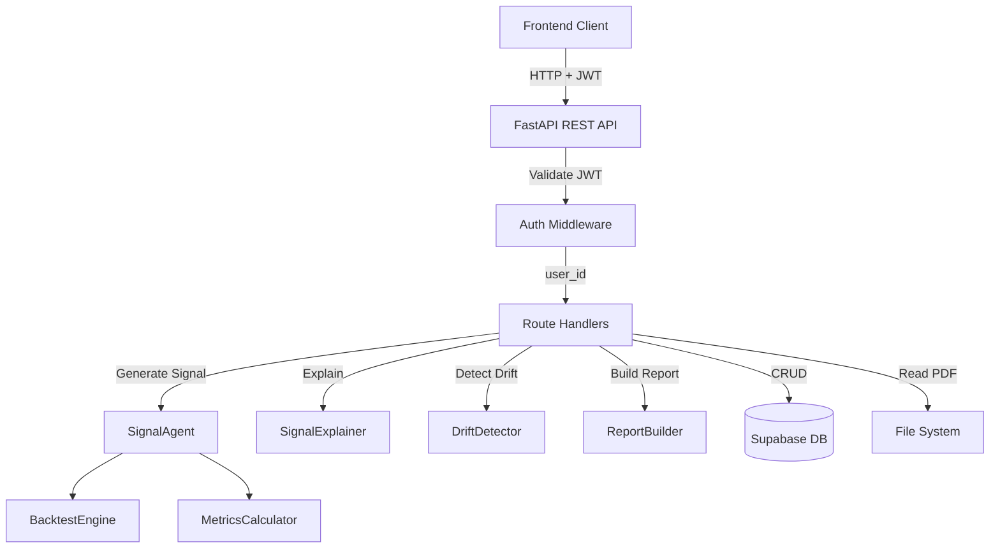

# Design Document: FastAPI REST API

## Overview

The FastAPI REST API exposes the QuantSignal Arena Python engine as a production-ready web service. It provides HTTP endpoints for signal generation, backtesting, leaderboard queries, and report downloads, with Supabase for persistence and JWT authentication for security.

## Architecture

### System Context



### Component Architecture

```
backend/api/
├── main.py                    # FastAPI app entry point, CORS, middleware
├── routes/
│   ├── signals.py            # POST /generate, GET /{run_id}, GET /{run_id}/report
│   ├── leaderboard.py        # GET /leaderboard, GET /leaderboard/{run_id}
│   └── reports.py            # GET /reports/{run_id} (alias for signals report)
├── middleware/
│   └── auth.py               # JWT validation, user_id extraction
├── models/
│   └── schemas.py            # Pydantic request/response models
└── db/
    └── supabase_client.py    # Supabase client wrapper, CRUD operations
```

### Data Flow

```
1. Client Request
   ↓
2. CORS Middleware (allow origins)
   ↓
3. Auth Middleware (validate JWT, extract user_id)
   ↓
4. Route Handler (validate request body)
   ↓
5. Business Logic (SignalAgent, SignalExplainer, etc.)
   ↓
6. Database Operation (Supabase CRUD)
   ↓
7. Response Serialization (Pydantic models)
   ↓
8. HTTP Response (JSON or FileResponse)
```

## Components and Interfaces

### 1. FastAPI Application (main.py)

```python
from fastapi import FastAPI
from fastapi.middleware.cors import CORSMiddleware
from api.middleware.auth import AuthMiddleware
from api.routes import signals, leaderboard

app = FastAPI(
    title="QuantSignal Arena API",
    version="1.0.0",
    description="REST API for AI-powered trading signal generation"
)

# CORS configuration
app.add_middleware(
    CORSMiddleware,
    allow_origins=["http://localhost:3000"],  # Frontend origin
    allow_credentials=True,
    allow_methods=["*"],
    allow_headers=["*"],
)

# Auth middleware
app.add_middleware(AuthMiddleware)

# Route registration
app.include_router(signals.router, prefix="/api/signals", tags=["signals"])
app.include_router(leaderboard.router, prefix="/api/leaderboard", tags=["leaderboard"])

@app.get("/api/health")
async def health_check():
    return {"status": "ok", "version": "1.0.0"}
```

### 2. Authentication Middleware (middleware/auth.py)

```python
from fastapi import Request, HTTPException
from starlette.middleware.base import BaseHTTPMiddleware
from jose import jwt, JWTError
import os

class AuthMiddleware(BaseHTTPMiddleware):
    """
    Validates Supabase JWT on every request except /api/health.
    Extracts user_id from JWT claims and attaches to request.state.
    """
    
    def __init__(self, app):
        super().__init__(app)
        self.supabase_jwt_secret = os.getenv("SUPABASE_JWT_SECRET")
        self.excluded_paths = ["/api/health", "/docs", "/openapi.json"]
    
    async def dispatch(self, request: Request, call_next):
        # Skip auth for excluded paths
        if request.url.path in self.excluded_paths:
            return await call_next(request)
        
        # Extract Authorization header
        auth_header = request.headers.get("Authorization")
        if not auth_header or not auth_header.startswith("Bearer "):
            raise HTTPException(status_code=401, detail="Missing or invalid Authorization header")
        
        token = auth_header.split(" ")[1]
        
        try:
            # Validate JWT
            payload = jwt.decode(
                token,
                self.supabase_jwt_secret,
                algorithms=["HS256"],
                options={"verify_aud": False}
            )
            
            # Extract user_id from sub claim
            user_id = payload.get("sub")
            if not user_id:
                raise HTTPException(status_code=401, detail="Invalid token: missing sub claim")
            
            # Attach user_id to request state
            request.state.user_id = user_id
            
        except JWTError as e:
            raise HTTPException(status_code=401, detail=f"Invalid token: {str(e)}")
        
        return await call_next(request)
```

### 3. Pydantic Schemas (models/schemas.py)

```python
from pydantic import BaseModel, Field
from typing import Optional
from datetime import datetime

class GenerateSignalRequest(BaseModel):
    hypothesis: str = Field(..., min_length=10, max_length=500)
    tickers: list[str] = Field(..., min_items=1, max_items=10)
    start_date: str = Field(..., pattern=r"^\d{4}-\d{2}-\d{2}$")
    end_date: str = Field(..., pattern=r"^\d{4}-\d{2}-\d{2}$")

class MetricsResponse(BaseModel):
    sharpe_ratio: Optional[float] = None
    sortino_ratio: Optional[float] = None
    max_drawdown: Optional[float] = None
    cagr: Optional[float] = None
    win_rate: Optional[float] = None
    total_return: Optional[float] = None
    volatility: Optional[float] = None

class SignalRunResponse(BaseModel):
    run_id: str
    hypothesis: str
    metrics: MetricsResponse
    shap_summary: Optional[str] = None
    drift_level: Optional[str] = None
    report_url: Optional[str] = None
    generated_code: Optional[str] = None
    success: bool
    error: Optional[str] = None
    created_at: str

class LeaderboardEntry(BaseModel):
    run_id: str
    hypothesis: str
    metrics: MetricsResponse
    created_at: str
    signal_name: Optional[str] = None

class LeaderboardResponse(BaseModel):
    entries: list[LeaderboardEntry]
    total: int
    limit: int
    metric: str

class PaperTradeRequest(BaseModel):
    pass  # No body required

class PaperTradeResponse(BaseModel):
    run_id: str
    is_paper_trading: bool
    message: str
```

### 4. Supabase Client (db/supabase_client.py)

```python
from supabase import create_client, Client
import os
from typing import Optional, Dict, Any, List

class SupabaseClient:
    """
    Wrapper for Supabase client with CRUD operations for signal_runs table.
    """
    
    def __init__(self):
        supabase_url = os.getenv("SUPABASE_URL")
        supabase_key = os.getenv("SUPABASE_KEY")
        self.client: Client = create_client(supabase_url, supabase_key)
    
    async def create_run(self, user_id: str, run_data: Dict[str, Any]) -> str:
        """
        Insert new signal run into database.
        Returns run_id.
        """
        data = {
            "user_id": user_id,
            **run_data
        }
        result = self.client.table("signal_runs").insert(data).execute()
        return result.data[0]["id"]
    
    async def get_run(self, run_id: str, user_id: str) -> Optional[Dict[str, Any]]:
        """
        Fetch run by run_id, filtered by user_id (RLS).
        Returns None if not found or unauthorized.
        """
        result = self.client.table("signal_runs")\
            .select("*")\
            .eq("id", run_id)\
            .eq("user_id", user_id)\
            .execute()
        
        return result.data[0] if result.data else None
    
    async def update_run(self, run_id: str, user_id: str, updates: Dict[str, Any]) -> bool:
        """
        Update run by run_id, filtered by user_id (RLS).
        Returns True if successful.
        """
        result = self.client.table("signal_runs")\
            .update(updates)\
            .eq("id", run_id)\
            .eq("user_id", user_id)\
            .execute()
        
        return len(result.data) > 0
    
    async def get_leaderboard(
        self,
        limit: int = 20,
        metric: str = "sharpe_ratio"
    ) -> List[Dict[str, Any]]:
        """
        Fetch top runs ordered by metric descending.
        Only returns successful runs.
        """
        result = self.client.table("signal_runs")\
            .select("*")\
            .eq("success", True)\
            .order(metric, desc=True)\
            .limit(limit)\
            .execute()
        
        return result.data
    
    async def mark_paper_trading(self, run_id: str, user_id: str) -> bool:
        """
        Mark run as active for paper trading.
        """
        return await self.update_run(
            run_id,
            user_id,
            {"is_paper_trading": True}
        )

# Singleton instance
supabase_client = SupabaseClient()
```

### 5. Signals Routes (routes/signals.py)

```python
from fastapi import APIRouter, Request, HTTPException, Depends
from fastapi.responses import FileResponse, StreamingResponse
from sse_starlette.sse import EventSourceResponse
from api.models.schemas import (
    GenerateSignalRequest,
    SignalRunResponse,
    MetricsResponse,
    PaperTradeResponse
)
from api.db.supabase_client import supabase_client
from agent.signal_agent import SignalAgent
from shap_layer.explainer import SignalExplainer
from shap_layer.drift_detector import DriftDetector
from shap_layer.report_builder import ReportBuilder
from backtester.data_loader import DataLoader
import os
import asyncio

router = APIRouter()

async def generate_signal_stream(
    request: GenerateSignalRequest,
    user_id: str
):
    """
    Generator function for SSE streaming during signal generation.
    """
    try:
        yield {"event": "started", "data": {"progress": 0, "message": "Starting signal generation"}}
        
        # Load OHLCV data
        data_loader = DataLoader()
        ohlcv_data = data_loader.load_data(
            request.tickers[0],
            request.start_date,
            request.end_date
        )
        
        yield {"event": "generating_signal", "data": {"progress": 20, "message": "Generating signal with Claude"}}
        
        # Generate signal
        signal_agent = SignalAgent(...)  # Initialize with dependencies
        result = signal_agent.generate_and_backtest(
            request.hypothesis,
            ohlcv_data
        )
        
        if not result["success"]:
            yield {"event": "error", "data": {"message": result["error"]}}
            return
        
        yield {"event": "running_backtest", "data": {"progress": 40, "message": "Running backtest"}}
        
        # Compute SHAP explanations
        yield {"event": "computing_shap", "data": {"progress": 60, "message": "Computing SHAP explanations"}}
        
        signal = result["signal"]
        explainer = SignalExplainer(signal)
        shap_results = explainer.explain(ohlcv_data)
        
        # Detect drift
        yield {"event": "detecting_drift", "data": {"progress": 75, "message": "Detecting distribution drift"}}
        
        detector = DriftDetector(signal)
        drift_results = detector.detect(ohlcv_data)
        
        # Build report
        yield {"event": "building_report", "data": {"progress": 85, "message": "Building PDF report"}}
        
        report_builder = ReportBuilder()
        report_path = report_builder.build(
            hypothesis=request.hypothesis,
            backtest_results=result["backtest_results"],
            metrics=result["metrics"],
            shap_results=shap_results,
            drift_results=drift_results,
            generated_code=result["generated_code"]
        )
        
        # Save to database
        run_data = {
            "hypothesis": request.hypothesis,
            "tickers": request.tickers,
            "start_date": request.start_date,
            "end_date": request.end_date,
            "generated_code": result["generated_code"],
            "signal_name": result["signal_name"],
            "attempts_taken": result["attempts_taken"],
            "success": True,
            "sharpe_ratio": result["metrics"].get("sharpe_ratio"),
            "sortino_ratio": result["metrics"].get("sortino_ratio"),
            "max_drawdown": result["metrics"].get("max_drawdown"),
            "cagr": result["metrics"].get("cagr"),
            "win_rate": result["metrics"].get("win_rate"),
            "total_return": result["metrics"].get("total_return"),
            "volatility": result["metrics"].get("volatility"),
            "shap_summary": shap_results.get("summary"),
            "shap_feature_importance": shap_results.get("feature_importance"),
            "drift_level": drift_results.get("drift_level"),
            "signal_psi": drift_results.get("signal_psi"),
            "return_psi": drift_results.get("return_psi"),
            "report_path": report_path
        }
        
        run_id = await supabase_client.create_run(user_id, run_data)
        
        yield {
            "event": "completed",
            "data": {
                "progress": 100,
                "message": "Signal generation complete",
                "run_id": run_id,
                "report_url": f"/api/signals/{run_id}/report"
            }
        }
        
    except Exception as e:
        yield {"event": "error", "data": {"message": str(e)}}

@router.post("/generate", response_model=SignalRunResponse)
async def generate_signal(
    request: GenerateSignalRequest,
    http_request: Request
):
    """
    Generate trading signal with streaming progress updates.
    """
    user_id = http_request.state.user_id
    
    return EventSourceResponse(
        generate_signal_stream(request, user_id)
    )

@router.get("/{run_id}", response_model=SignalRunResponse)
async def get_signal_run(run_id: str, request: Request):
    """
    Fetch signal run by ID.
    """
    user_id = request.state.user_id
    
    run = await supabase_client.get_run(run_id, user_id)
    if not run:
        raise HTTPException(status_code=404, detail="Run not found")
    
    return SignalRunResponse(
        run_id=run["id"],
        hypothesis=run["hypothesis"],
        metrics=MetricsResponse(
            sharpe_ratio=run.get("sharpe_ratio"),
            sortino_ratio=run.get("sortino_ratio"),
            max_drawdown=run.get("max_drawdown"),
            cagr=run.get("cagr"),
            win_rate=run.get("win_rate"),
            total_return=run.get("total_return"),
            volatility=run.get("volatility")
        ),
        shap_summary=run.get("shap_summary"),
        drift_level=run.get("drift_level"),
        report_url=f"/api/signals/{run_id}/report" if run.get("report_path") else None,
        generated_code=run.get("generated_code"),
        success=run["success"],
        error=run.get("error_message"),
        created_at=run["created_at"]
    )

@router.get("/{run_id}/report")
async def get_signal_report(run_id: str, request: Request):
    """
    Download PDF report for signal run.
    """
    user_id = request.state.user_id
    
    run = await supabase_client.get_run(run_id, user_id)
    if not run:
        raise HTTPException(status_code=404, detail="Run not found")
    
    report_path = run.get("report_path")
    if not report_path or not os.path.exists(report_path):
        raise HTTPException(status_code=404, detail="Report not found")
    
    return FileResponse(
        report_path,
        media_type="application/pdf",
        filename=f"signal_report_{run_id}.pdf"
    )

@router.post("/{run_id}/paper_trade", response_model=PaperTradeResponse)
async def activate_paper_trading(run_id: str, request: Request):
    """
    Mark signal as active for paper trading.
    """
    user_id = request.state.user_id
    
    run = await supabase_client.get_run(run_id, user_id)
    if not run:
        raise HTTPException(status_code=404, detail="Run not found")
    
    if not run["success"]:
        raise HTTPException(status_code=400, detail="Cannot paper trade failed signal")
    
    success = await supabase_client.mark_paper_trading(run_id, user_id)
    
    return PaperTradeResponse(
        run_id=run_id,
        is_paper_trading=True,
        message="Signal activated for paper trading"
    )
```

### 6. Leaderboard Routes (routes/leaderboard.py)

```python
from fastapi import APIRouter, Query, HTTPException
from api.models.schemas import LeaderboardResponse, LeaderboardEntry, MetricsResponse
from api.db.supabase_client import supabase_client

router = APIRouter()

VALID_METRICS = ["sharpe_ratio", "sortino_ratio", "cagr", "total_return"]

@router.get("", response_model=LeaderboardResponse)
async def get_leaderboard(
    limit: int = Query(default=20, ge=1, le=100),
    metric: str = Query(default="sharpe_ratio")
):
    """
    Fetch top signal runs ordered by metric.
    """
    if metric not in VALID_METRICS:
        raise HTTPException(
            status_code=400,
            detail=f"Invalid metric. Must be one of: {', '.join(VALID_METRICS)}"
        )
    
    runs = await supabase_client.get_leaderboard(limit, metric)
    
    entries = [
        LeaderboardEntry(
            run_id=run["id"],
            hypothesis=run["hypothesis"],
            metrics=MetricsResponse(
                sharpe_ratio=run.get("sharpe_ratio"),
                sortino_ratio=run.get("sortino_ratio"),
                max_drawdown=run.get("max_drawdown"),
                cagr=run.get("cagr"),
                win_rate=run.get("win_rate"),
                total_return=run.get("total_return"),
                volatility=run.get("volatility")
            ),
            created_at=run["created_at"],
            signal_name=run.get("signal_name")
        )
        for run in runs
    ]
    
    return LeaderboardResponse(
        entries=entries,
        total=len(entries),
        limit=limit,
        metric=metric
    )

@router.get("/{run_id}", response_model=LeaderboardEntry)
async def get_leaderboard_entry(run_id: str):
    """
    Fetch single leaderboard entry by run_id.
    """
    # Note: This endpoint does not require auth, so we query without user_id filter
    result = supabase_client.client.table("signal_runs")\
        .select("*")\
        .eq("id", run_id)\
        .eq("success", True)\
        .execute()
    
    if not result.data:
        raise HTTPException(status_code=404, detail="Leaderboard entry not found")
    
    run = result.data[0]
    
    return LeaderboardEntry(
        run_id=run["id"],
        hypothesis=run["hypothesis"],
        metrics=MetricsResponse(
            sharpe_ratio=run.get("sharpe_ratio"),
            sortino_ratio=run.get("sortino_ratio"),
            max_drawdown=run.get("max_drawdown"),
            cagr=run.get("cagr"),
            win_rate=run.get("win_rate"),
            total_return=run.get("total_return"),
            volatility=run.get("volatility")
        ),
        created_at=run["created_at"],
        signal_name=run.get("signal_name")
    )
```

## Database Schema

### Supabase SQL Migration

```sql
-- Create signal_runs table
create table signal_runs (
    id uuid primary key default gen_random_uuid(),
    user_id uuid references auth.users(id),
    hypothesis text not null,
    tickers text[] not null,
    start_date date not null,
    end_date date not null,
    generated_code text,
    signal_name text,
    attempts_taken int,
    success bool not null default false,
    error_message text,
    sharpe_ratio float,
    sortino_ratio float,
    max_drawdown float,
    cagr float,
    win_rate float,
    total_return float,
    volatility float,
    shap_summary text,
    shap_feature_importance jsonb,
    drift_level text,
    signal_psi float,
    return_psi float,
    report_path text,
    is_paper_trading bool default false,
    created_at timestamptz default now(),
    updated_at timestamptz default now()
);

-- Create indexes
create index signal_runs_user_id_idx on signal_runs(user_id);
create index signal_runs_sharpe_ratio_idx on signal_runs(sharpe_ratio desc);
create index signal_runs_created_at_idx on signal_runs(created_at desc);

-- Enable Row Level Security
alter table signal_runs enable row level security;

-- RLS policies
create policy "users can read own runs"
    on signal_runs
    for select
    using (auth.uid() = user_id);

create policy "users can insert own runs"
    on signal_runs
    for insert
    with check (auth.uid() = user_id);

create policy "users can update own runs"
    on signal_runs
    for update
    using (auth.uid() = user_id);

-- Trigger to update updated_at
create or replace function update_updated_at_column()
returns trigger as $$
begin
    new.updated_at = now();
    return new;
end;
$$ language plpgsql;

create trigger update_signal_runs_updated_at
    before update on signal_runs
    for each row
    execute function update_updated_at_column();
```

## Environment Variables

```bash
# Supabase
SUPABASE_URL=https://your-project.supabase.co
SUPABASE_KEY=your-anon-key
SUPABASE_JWT_SECRET=your-jwt-secret

# Anthropic (for SignalAgent)
ANTHROPIC_API_KEY=your-anthropic-key

# API Configuration
API_HOST=0.0.0.0
API_PORT=8000
CORS_ORIGINS=http://localhost:3000,https://your-frontend.com
```

## Error Response Format

```json
{
    "detail": "Error message",
    "status_code": 400,
    "timestamp": "2024-01-15T10:30:00Z"
}
```

## Testing Strategy

### Unit Tests

1. Test auth middleware with valid/invalid/missing tokens
2. Test Pydantic schema validation for all request models
3. Test Supabase client CRUD operations with mocked client
4. Test route handlers with mocked dependencies

### Integration Tests

1. Test full signal generation flow with TestClient
2. Test SSE streaming for progress updates
3. Test file download for PDF reports
4. Test leaderboard queries with different parameters
5. Test authorization failures for protected endpoints

### Test Configuration

```python
# conftest.py
import pytest
from fastapi.testclient import TestClient
from api.main import app
from unittest.mock import Mock, patch

@pytest.fixture
def client():
    return TestClient(app)

@pytest.fixture
def mock_supabase():
    with patch("api.db.supabase_client.supabase_client") as mock:
        yield mock

@pytest.fixture
def mock_signal_agent():
    with patch("api.routes.signals.SignalAgent") as mock:
        yield mock

@pytest.fixture
def valid_jwt_token():
    # Generate valid JWT for testing
    return "Bearer eyJhbGciOiJIUzI1NiIsInR5cCI6IkpXVCJ9..."
```

## Dependencies

Add to `backend/requirements.txt`:

```
# FastAPI REST API (Month 4)
fastapi>=0.109.0
uvicorn[standard]>=0.27.0
supabase>=2.3.0
python-jose[cryptography]>=3.3.0
python-multipart>=0.0.9
sse-starlette>=1.8.0
```

## Deployment

### Local Development

```bash
cd backend
uvicorn api.main:app --reload --host 0.0.0.0 --port 8000
```

### Production

```bash
uvicorn api.main:app --host 0.0.0.0 --port 8000 --workers 4
```

## Summary

The FastAPI REST API provides a production-ready interface to the QuantSignal Arena engine with:

- 7 REST endpoints for signal generation, retrieval, leaderboard, and paper trading
- JWT authentication with Supabase
- Server-Sent Events for real-time progress updates
- Comprehensive error handling and validation
- Row Level Security for multi-tenant data isolation
- Full test coverage with mocked dependencies
