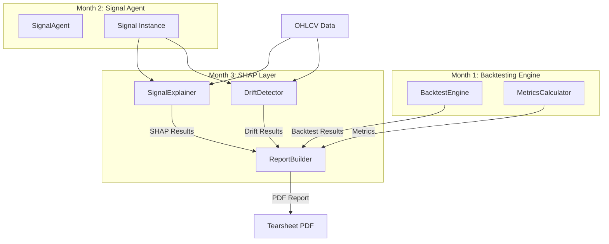

# Design Document: SHAP Explainability Layer

## Overview

The SHAP Explainability Layer adds interpretability and monitoring capabilities to QuantSignal Arena's trading signals. It consists of three core components:

1. **SignalExplainer**: Generates technical features from OHLCV data, trains a surrogate classifier to mimic signal behavior, and computes SHAP values to explain which features drive predictions
2. **DriftDetector**: Monitors signal and return distributions over time using Population Stability Index (PSI) to detect regime changes
3. **ReportBuilder**: Generates professional PDF tearsheet reports combining performance metrics, SHAP explanations, and drift analysis

The layer integrates seamlessly with existing Month 1 (backtesting engine) and Month 2 (signal agent) components, accepting their outputs and producing publication-ready documentation.

## Architecture

### System Context



### Data Flow

```
OHLCV Data (DataFrame)
    ↓
SignalExplainer.engineer_features()
    ↓
Features DataFrame (8 columns: returns_1d, returns_5d, returns_20d, 
                    volatility_20d, volume_ratio, price_momentum, 
                    rsi_14, bb_position)
    ↓
SignalExplainer.explain()
    ↓
Train LightGBM/RandomForest classifier (signal direction prediction)
    ↓
Compute SHAP values using TreeExplainer
    ↓
SHAP Results (dict with shap_values, feature_importance, summary)
    ↓
ReportBuilder.build()
    ↓
PDF Tearsheet (equity curve, SHAP charts, drift analysis, code)
```

### Component Interactions

- **SignalExplainer** receives Signal instance and OHLCV data, produces SHAP explanations
- **DriftDetector** receives Signal instance and OHLCV data, produces PSI metrics
- **ReportBuilder** aggregates outputs from SignalExplainer, DriftDetector, BacktestEngine, and MetricsCalculator into unified PDF

## Components and Interfaces

### SignalExplainer Class

**File**: `backend/shap_layer/explainer.py`

```python
from typing import Dict, List, Any, Optional
import pandas as pd
import numpy as np
from backend.backtester.signal_base import SignalBase

class SignalExplainer:
    """
    Explains trading signal predictions using SHAP values.
    
    Engineers technical features from OHLCV data, trains a surrogate
    classifier to mimic signal behavior, and computes SHAP values to
    identify key feature drivers.
    """
    
    def __init__(
        self,
        signal: SignalBase,
        use_lightgbm: bool = True,
        n_estimators: int = 100,
        random_state: int = 42
    ) -> None:
        """
        Initialize SignalExplainer.
        
        Args:
            signal: Trading signal instance to explain
            use_lightgbm: Use LightGBM if True, else RandomForest
            n_estimators: Number of trees in classifier
            random_state: Random seed for reproducibility
        """
        ...
    
    def engineer_features(self, ohlcv_data: pd.DataFrame) -> pd.DataFrame:
        """
        Generate technical features from OHLCV data.
        
        Args:
            ohlcv_data: DataFrame with OHLCV columns and DatetimeIndex
            
        Returns:
            DataFrame with 8 feature columns:
            - returns_1d: 1-day percentage returns
            - returns_5d: 5-day percentage returns
            - returns_20d: 20-day percentage returns
            - volatility_20d: 20-day rolling std of returns
            - volume_ratio: volume / 20-day avg volume
            - price_momentum: 10-day rate of change
            - rsi_14: 14-period RSI
            - bb_position: position within Bollinger Bands
        """
        ...
    
    def explain(
        self,
        ohlcv_data: pd.DataFrame,
        features: Optional[pd.DataFrame] = None
    ) -> Dict[str, Any]:
        """
        Generate SHAP explanations for signal predictions.
        
        Args:
            ohlcv_data: Historical OHLCV data
            features: Pre-computed features (optional, will compute if None)
            
        Returns:
            Dictionary containing:
            - shap_values: numpy array of shape (n_samples, n_features)
            - feature_names: list of feature names
            - feature_importance: dict mapping feature -> mean |SHAP|
            - base_value: float baseline prediction
            - summary: string describing top 3 features
            - model: trained classifier instance
            - features_used: DataFrame of features used for training
        """
        ...
    
    def get_top_features(self, n: int = 5) -> List[Dict[str, Any]]:
        """
        Get top N most important features.
        
        Args:
            n: Number of top features to return
            
        Returns:
            List of dicts with keys:
            - name: feature name
            - mean_shap: mean absolute SHAP value
            - direction: "positive" or "negative"
        """
        ...
```

### DriftDetector Class

**File**: `backend/shap_layer/drift_detector.py`

```python
from typing import Dict, Any
import pandas as pd
import numpy as np
from backend.backtester.signal_base import SignalBase

class DriftDetector:
    """
    Detects distribution drift in signals and returns using PSI.
    
    Monitors signal stability by comparing reference and recent
    distributions using Population Stability Index.
    """
    
    def __init__(
        self,
        signal: SignalBase,
        reference_window: int = 252,
        detection_window: int = 63,
        n_bins: int = 10
    ) -> None:
        """
        Initialize DriftDetector.
        
        Args:
            signal: Trading signal instance to monitor
            reference_window: Days for reference period (default 252 = 1 year)
            detection_window: Days for recent period (default 63 = 3 months)
            n_bins: Number of bins for PSI calculation (default 10)
        """
        ...
    
    def compute_psi(
        self,
        reference: pd.Series,
        current: pd.Series,
        n_bins: Optional[int] = None
    ) -> float:
        """
        Compute Population Stability Index between two distributions.
        
        Formula: PSI = Σ (current_pct - reference_pct) * ln(current_pct / reference_pct)
        
        Args:
            reference: Reference distribution
            current: Current distribution to compare
            n_bins: Number of bins (uses instance default if None)
            
        Returns:
            PSI value as float (0 = identical, >0.2 = significant drift)
        """
        ...
    
    def detect(self, ohlcv_data: pd.DataFrame) -> Dict[str, Any]:
        """
        Detect drift in signal and return distributions.
        
        Args:
            ohlcv_data: Historical OHLCV data
            
        Returns:
            Dictionary containing:
            - signal_psi: PSI for signal distribution
            - return_psi: PSI for return distribution
            - drift_detected: True if either PSI > 0.2
            - drift_level: "none", "moderate", or "significant"
            - recommendation: action recommendation string
            - reference_period: tuple of (start_date, end_date)
            - recent_period: tuple of (start_date, end_date)
        """
        ...
    
    def rolling_psi(
        self,
        ohlcv_data: pd.DataFrame,
        metric: str = "signal"
    ) -> pd.Series:
        """
        Compute rolling PSI over time.
        
        Args:
            ohlcv_data: Historical OHLCV data
            metric: "signal" or "returns" to track
            
        Returns:
            Series with DatetimeIndex and PSI values
        """
        ...
```

### ReportBuilder Class

**File**: `backend/shap_layer/report_builder.py`

```python
from typing import Dict, Any, Optional
from pathlib import Path
import pandas as pd
from fpdf import FPDF

class ReportBuilder:
    """
    Generates professional PDF tearsheet reports.
    
    Combines backtest results, SHAP explanations, and drift analysis
    into publication-quality documentation.
    """
    
    def __init__(
        self,
        output_dir: str = "reports",
        page_width: int = 210,
        page_height: int = 297
    ) -> None:
        """
        Initialize ReportBuilder.
        
        Args:
            output_dir: Directory for PDF output
            page_width: PDF page width in mm (default A4: 210)
            page_height: PDF page height in mm (default A4: 297)
        """
        ...
    
    def build(
        self,
        strategy_name: str,
        hypothesis: str,
        backtest_results: Dict[str, Any],
        metrics: Dict[str, Any],
        shap_results: Dict[str, Any],
        drift_results: Dict[str, Any],
        generated_code: str,
        ohlcv_data: pd.DataFrame
    ) -> str:
        """
        Generate complete PDF tearsheet.
        
        Args:
            strategy_name: Name of trading strategy
            hypothesis: Plain English hypothesis text
            backtest_results: Output from BacktestEngine.run_backtest()
            metrics: Output from MetricsCalculator.calculate_metrics()
            shap_results: Output from SignalExplainer.explain()
            drift_results: Output from DriftDetector.detect()
            generated_code: Python signal code
            ohlcv_data: Historical OHLCV data for date range
            
        Returns:
            Full path to generated PDF file
        """
        ...
    
    def _add_header(
        self,
        pdf: FPDF,
        strategy_name: str,
        hypothesis: str,
        date_range: tuple
    ) -> None:
        """Add report header with strategy info."""
        ...
    
    def _add_performance_summary(
        self,
        pdf: FPDF,
        metrics: Dict[str, Any]
    ) -> None:
        """Add performance metrics table."""
        ...
    
    def _add_equity_curve(
        self,
        pdf: FPDF,
        portfolio_value: pd.Series,
        temp_dir: Path
    ) -> None:
        """Generate and embed equity curve chart."""
        ...
    
    def _add_shap_analysis(
        self,
        pdf: FPDF,
        shap_results: Dict[str, Any],
        temp_dir: Path
    ) -> None:
        """Add SHAP feature importance chart and summary."""
        ...
    
    def _add_drift_analysis(
        self,
        pdf: FPDF,
        drift_results: Dict[str, Any]
    ) -> None:
        """Add drift detection results with color-coded status."""
        ...
    
    def _add_code_section(
        self,
        pdf: FPDF,
        code: str
    ) -> None:
        """Add generated signal code with syntax highlighting."""
        ...
```

## Data Models

### Feature Engineering Specifications

All features are computed from OHLCV data with the following exact formulas:

1. **returns_1d**: `close.pct_change(1)`
2. **returns_5d**: `close.pct_change(5)`
3. **returns_20d**: `close.pct_change(20)`
4. **volatility_20d**: `returns_1d.rolling(20).std()`
5. **volume_ratio**: `volume / volume.rolling(20).mean()`
6. **price_momentum**: `(close - close.shift(10)) / close.shift(10)`
7. **rsi_14**: 
   ```
   delta = close.diff()
   gain = delta.where(delta > 0, 0).rolling(14).mean()
   loss = -delta.where(delta < 0, 0).rolling(14).mean()
   rs = gain / loss
   rsi = 100 - (100 / (1 + rs))
   ```
8. **bb_position**:
   ```
   sma_20 = close.rolling(20).mean()
   std_20 = close.rolling(20).std()
   upper_band = sma_20 + (2 * std_20)
   lower_band = sma_20 - (2 * std_20)
   bb_position = (close - lower_band) / (upper_band - lower_band)
   ```

### PSI Calculation Formula

Population Stability Index (PSI) measures distribution drift:

```
PSI = Σ (current_pct - reference_pct) * ln(current_pct / reference_pct)
```

**Implementation details**:
- Discretize both distributions into `n_bins` bins using quantiles from reference
- Calculate percentage of samples in each bin for both distributions
- Add epsilon (1e-10) to avoid division by zero
- Sum across all bins

**Interpretation**:
- PSI < 0.1: No significant drift ("none")
- 0.1 ≤ PSI ≤ 0.2: Moderate drift ("moderate")
- PSI > 0.2: Significant drift ("significant")

### SHAP Results Schema

```python
{
    "shap_values": np.ndarray,  # shape (n_samples, n_features)
    "feature_names": List[str],  # ["returns_1d", "returns_5d", ...]
    "feature_importance": Dict[str, float],  # {"returns_1d": 0.15, ...}
    "base_value": float,  # baseline prediction
    "summary": str,  # "Top drivers: returns_20d (0.15), volatility_20d (0.12), ..."
    "model": object,  # trained classifier
    "features_used": pd.DataFrame  # features DataFrame used for training
}
```

### Drift Results Schema

```python
{
    "signal_psi": float,  # PSI for signal distribution
    "return_psi": float,  # PSI for return distribution
    "drift_detected": bool,  # True if either PSI > 0.2
    "drift_level": str,  # "none", "moderate", or "significant"
    "recommendation": str,  # "signal stable", "monitor closely", "consider retraining"
    "reference_period": Tuple[pd.Timestamp, pd.Timestamp],
    "recent_period": Tuple[pd.Timestamp, pd.Timestamp]
}
```

### PDF Tearsheet Layout

**Page 1: Header & Performance**
- Header: Strategy name, hypothesis, date range, generation timestamp
- Performance Summary Table:
  - Sharpe Ratio
  - Sortino Ratio
  - Max Drawdown
  - CAGR
  - Win Rate
  - Total Return
  - Volatility
  - Calmar Ratio
- Equity Curve Chart (full width, 150mm x 80mm)

**Page 2: SHAP Analysis**
- Section title: "Feature Importance Analysis"
- SHAP summary text (top 3 features)
- Horizontal bar chart (150mm x 100mm) showing top 10 features
- X-axis: "Mean |SHAP Value|"
- Y-axis: Feature names
- Sorted by absolute importance descending

**Page 3: Drift Analysis**
- Section title: "Distribution Stability"
- Signal PSI with color-coded status
- Return PSI with color-coded status
- Recommendation text
- Reference and recent period dates

**Page 4: Generated Code**
- Section title: "Signal Implementation"
- Syntax-highlighted Python code
- Monospace font (Courier, 8pt)

## Correctness Properties


*A property is a characteristic or behavior that should hold true across all valid executions of a system—essentially, a formal statement about what the system should do. Properties serve as the bridge between human-readable specifications and machine-verifiable correctness guarantees.*

### Property 1: Feature Engineering Correctness

*For any* OHLCV DataFrame with sufficient history (≥20 days), the engineer_features method should compute all 8 features using the exact formulas specified in the design, and the output DataFrame should have the same DatetimeIndex as the input with no NaN values in the final output.

**Validates: Requirements 1.1, 1.2, 1.3, 1.4, 1.5, 1.6, 1.7, 1.8, 1.9, 1.10**

### Property 2: SHAP Output Schema Completeness

*For any* valid Signal and OHLCV data, the explain method should return a dictionary containing all required keys (shap_values, feature_names, feature_importance, base_value, summary, model, features_used) with correct types, and shap_values shape should match (n_samples, n_features).

**Validates: Requirements 2.6, 2.7, 2.8, 2.9, 2.10, 2.11**

### Property 3: Signal Filtering for Training

*For any* Signal and OHLCV data, when training the classifier, only samples where signal value is 1 or -1 should be included in the training set, excluding all neutral positions (0).

**Validates: Requirements 2.4**

### Property 4: Top Features Structure and Sorting

*For any* value of n, get_top_features(n) should return exactly n features (or fewer if fewer exist), each as a dict with keys {name, mean_shap, direction}, sorted by absolute mean_shap in descending order, where direction is "positive" if mean_shap > 0 else "negative".

**Validates: Requirements 3.1, 3.2, 3.3, 3.4, 3.5, 3.6, 3.7**

### Property 5: PSI Symmetry and Identity

*For any* two identical distributions, compute_psi should return a value approximately equal to 0.0 (within numerical tolerance), and PSI should be symmetric with respect to which distribution is reference vs current.

**Validates: Requirements 4.1, 4.4, 4.8**

### Property 6: PSI Classification Thresholds

*For any* PSI value, the drift_level classification should be "none" if PSI < 0.1, "moderate" if 0.1 ≤ PSI ≤ 0.2, and "significant" if PSI > 0.2.

**Validates: Requirements 4.5, 4.6, 4.7**

### Property 7: Drift Detection Window Splitting

*For any* OHLCV data with sufficient length, the detect method should split data into reference period (first reference_window days) and recent period (last detection_window days), and both periods should have the expected number of samples.

**Validates: Requirements 5.1, 5.2**

### Property 8: Drift Detection Output Schema

*For any* valid Signal and OHLCV data, the detect method should return a dictionary containing all required keys (signal_psi, return_psi, drift_detected, drift_level, recommendation, reference_period, recent_period) with correct types.

**Validates: Requirements 5.6, 5.7, 5.8, 5.11, 5.12**

### Property 9: Drift Detection Logic

*For any* drift detection result, drift_detected should be True if and only if either signal_psi > 0.2 or return_psi > 0.2.

**Validates: Requirements 5.9, 5.10**

### Property 10: Recommendation Mapping

*For any* drift_level value, the recommendation should be "signal stable" if drift_level is "none", "monitor closely" if "moderate", and "consider retraining" if "significant".

**Validates: Requirements 5.13, 5.14, 5.15**

### Property 11: Rolling PSI Output Structure

*For any* OHLCV data with sufficient length, rolling_psi should return a Series with DatetimeIndex and float values, with one PSI value for each valid rolling window pair.

**Validates: Requirements 6.4, 6.5, 6.6**

### Property 12: PDF File Creation and Naming

*For any* valid inputs, the build method should create a PDF file in the output directory (creating the directory if it doesn't exist), with filename format {strategy_name}_{date}.pdf, and return the full file path as a string.

**Validates: Requirements 7.1, 7.11, 7.12, 7.13**

### Property 13: Report Content Completeness

*For any* valid inputs, the generated PDF should contain all required sections: header with strategy name, hypothesis, and date; performance summary table with all metrics; equity curve chart; SHAP feature importance chart; drift analysis section; and generated code block.

**Validates: Requirements 7.2, 7.3**

### Property 14: Feature Importance Chart Limiting

*For any* SHAP results, the feature importance chart should display at most 10 features, sorted by absolute importance in descending order.

**Validates: Requirements 8.4, 8.5**

### Property 15: SignalBase Compatibility

*For any* Signal instance that inherits from SignalBase, the SignalExplainer should accept it and work with OHLCV data in the same format as BacktestEngine expects.

**Validates: Requirements 9.2, 9.3**

## Error Handling

### SignalExplainer Error Handling

1. **Insufficient Data**: If OHLCV data has fewer than 20 rows, raise ValueError with message indicating minimum data requirement
2. **Invalid Signal**: If signal generates all neutral positions (0), raise ValueError indicating insufficient signal variation for training
3. **Feature Computation Failures**: If any feature computation fails, log warning and attempt to continue with available features
4. **Model Training Failures**: If classifier training fails, raise RuntimeError with details about the failure
5. **SHAP Computation Failures**: If SHAP value computation fails, raise RuntimeError with details

### DriftDetector Error Handling

1. **Insufficient Data**: If OHLCV data length < (reference_window + detection_window), raise ValueError with message indicating minimum data requirement
2. **Empty Distributions**: If either reference or current distribution is empty after filtering, raise ValueError
3. **PSI Computation Errors**: Handle division by zero in PSI calculation using epsilon (1e-10) to avoid inf/nan
4. **Invalid Window Parameters**: If reference_window or detection_window ≤ 0, raise ValueError

### ReportBuilder Error Handling

1. **Missing Required Data**: If any required input (backtest_results, metrics, shap_results, drift_results) is None or missing required keys, raise ValueError with specific missing field
2. **Chart Generation Failures**: If matplotlib chart generation fails, log error and continue with text-only report
3. **PDF Creation Failures**: If fpdf2 raises exception during PDF creation, raise RuntimeError with details
4. **File System Errors**: If output directory cannot be created or PDF cannot be written, raise IOError with details
5. **Invalid Metrics**: If metrics contain None values, display "N/A" in report instead of raising error

## Testing Strategy

### Unit Testing Approach

Unit tests focus on specific examples, edge cases, and integration points:

1. **Feature Engineering**: Test each feature formula with known input/output pairs
2. **PSI Calculation**: Test PSI formula with hand-calculated examples
3. **Drift Classification**: Test threshold boundaries (PSI = 0.09, 0.1, 0.2, 0.21)
4. **Report Generation**: Test that PDF files are created with expected structure
5. **Error Handling**: Test all error conditions with invalid inputs
6. **Integration**: Test end-to-end workflow with real Signal instances

### Property-Based Testing Approach

Property tests verify universal properties across randomized inputs using Hypothesis library (minimum 100 iterations per test):

**Test Configuration**:
- Library: hypothesis>=6.82.0
- Iterations: 100 minimum per property test
- Tag format: `# Feature: shap-explainability-layer, Property {N}: {property_text}`

**Property Test Cases**:

1. **Property 1 Test**: Generate random OHLCV data (≥20 days), verify all 8 features computed correctly and output has matching index with no NaN
   - Tag: `# Feature: shap-explainability-layer, Property 1: Feature Engineering Correctness`

2. **Property 2 Test**: Generate random Signal and OHLCV data, verify explain() output has all required keys with correct types
   - Tag: `# Feature: shap-explainability-layer, Property 2: SHAP Output Schema Completeness`

3. **Property 3 Test**: Generate random Signal with mixed positions, verify training data excludes zeros
   - Tag: `# Feature: shap-explainability-layer, Property 3: Signal Filtering for Training`

4. **Property 4 Test**: Generate random n and SHAP results, verify get_top_features returns correct structure and sorting
   - Tag: `# Feature: shap-explainability-layer, Property 4: Top Features Structure and Sorting`

5. **Property 5 Test**: Generate random distribution, verify PSI(dist, dist) ≈ 0
   - Tag: `# Feature: shap-explainability-layer, Property 5: PSI Symmetry and Identity`

6. **Property 6 Test**: Generate random PSI values, verify classification matches thresholds
   - Tag: `# Feature: shap-explainability-layer, Property 6: PSI Classification Thresholds`

7. **Property 7 Test**: Generate random OHLCV data, verify window splitting produces correct sizes
   - Tag: `# Feature: shap-explainability-layer, Property 7: Drift Detection Window Splitting`

8. **Property 8 Test**: Generate random Signal and OHLCV data, verify detect() output schema
   - Tag: `# Feature: shap-explainability-layer, Property 8: Drift Detection Output Schema`

9. **Property 9 Test**: Generate random PSI values, verify drift_detected logic
   - Tag: `# Feature: shap-explainability-layer, Property 9: Drift Detection Logic`

10. **Property 10 Test**: Generate random drift_level values, verify recommendation mapping
    - Tag: `# Feature: shap-explainability-layer, Property 10: Recommendation Mapping`

11. **Property 11 Test**: Generate random OHLCV data, verify rolling_psi output structure
    - Tag: `# Feature: shap-explainability-layer, Property 11: Rolling PSI Output Structure`

12. **Property 12 Test**: Generate random strategy names and dates, verify PDF filename format
    - Tag: `# Feature: shap-explainability-layer, Property 12: PDF File Creation and Naming`

13. **Property 13 Test**: Generate random valid inputs, verify PDF contains all required sections
    - Tag: `# Feature: shap-explainability-layer, Property 13: Report Content Completeness`

14. **Property 14 Test**: Generate random SHAP results with varying feature counts, verify chart shows ≤10 features
    - Tag: `# Feature: shap-explainability-layer, Property 14: Feature Importance Chart Limiting`

15. **Property 15 Test**: Generate random SignalBase subclasses, verify SignalExplainer accepts them
    - Tag: `# Feature: shap-explainability-layer, Property 15: SignalBase Compatibility`

### Test Data Generators

**Hypothesis Strategies**:

```python
from hypothesis import strategies as st
import pandas as pd
import numpy as np

@st.composite
def ohlcv_dataframe(draw, min_days=20, max_days=500):
    """Generate random OHLCV DataFrame."""
    n_days = draw(st.integers(min_value=min_days, max_value=max_days))
    dates = pd.date_range(end='2024-01-01', periods=n_days, freq='D')
    
    # Generate realistic price data
    initial_price = draw(st.floats(min_value=10.0, max_value=1000.0))
    returns = draw(st.lists(
        st.floats(min_value=-0.1, max_value=0.1),
        min_size=n_days,
        max_size=n_days
    ))
    
    close = initial_price * (1 + pd.Series(returns)).cumprod()
    high = close * draw(st.floats(min_value=1.0, max_value=1.05))
    low = close * draw(st.floats(min_value=0.95, max_value=1.0))
    open_ = draw(st.floats(min_value=0.98, max_value=1.02)) * close
    volume = draw(st.integers(min_value=1000, max_value=1000000))
    
    return pd.DataFrame({
        'Open': open_,
        'High': high,
        'Low': low,
        'Close': close,
        'Volume': volume
    }, index=dates)

@st.composite
def signal_instance(draw):
    """Generate random MomentumSignal instance."""
    from backend.backtester.signal_base import MomentumSignal
    lookback = draw(st.integers(min_value=5, max_value=50))
    return MomentumSignal(lookback_period=lookback)
```

## Dependencies

### Required Python Packages

Add to `backend/requirements.txt`:

```
# SHAP Explainability Layer (Month 3)
shap>=0.44.0
lightgbm>=4.0.0
fpdf2>=2.7.0
scikit-learn>=1.3.0
matplotlib>=3.7.0
```

### Dependency Rationale

- **shap>=0.44.0**: Core library for SHAP value computation, TreeExplainer for tree-based models
- **lightgbm>=4.0.0**: Primary classifier for signal prediction (fast, accurate, tree-based)
- **scikit-learn>=1.3.0**: Fallback RandomForest classifier, preprocessing utilities
- **fpdf2>=2.7.0**: PDF generation library with modern Python 3 support
- **matplotlib>=3.7.0**: Chart generation for equity curves and feature importance plots

### Import Structure

```python
# backend/shap_layer/explainer.py
import pandas as pd
import numpy as np
import shap
try:
    import lightgbm as lgb
    HAS_LIGHTGBM = True
except ImportError:
    HAS_LIGHTGBM = False
    from sklearn.ensemble import RandomForestClassifier

# backend/shap_layer/drift_detector.py
import pandas as pd
import numpy as np

# backend/shap_layer/report_builder.py
from fpdf import FPDF
import matplotlib.pyplot as plt
import matplotlib
matplotlib.use('Agg')  # Non-interactive backend for server environments
```

## Implementation Notes

### Feature Engineering Implementation Details

1. **NaN Handling**: After computing all features, use `dropna()` to remove rows with any NaN values (typically first 20 rows due to rolling windows)
2. **RSI Calculation**: Use Wilder's smoothing method (exponential moving average with alpha=1/14)
3. **Bollinger Bands**: Ensure upper_band != lower_band before computing bb_position; if equal, set to 0.5

### SHAP Computation Optimization

1. **TreeExplainer**: Use `shap.TreeExplainer(model)` for LightGBM/RandomForest (fast, exact)
2. **Background Data**: Use full training set as background for TreeExplainer (no sampling needed)
3. **Feature Importance**: Compute as `np.abs(shap_values).mean(axis=0)` for each feature

### PSI Computation Implementation

```python
def compute_psi(reference: pd.Series, current: pd.Series, n_bins: int = 10) -> float:
    """Compute PSI between two distributions."""
    # Create bins from reference distribution
    bins = np.percentile(reference, np.linspace(0, 100, n_bins + 1))
    bins = np.unique(bins)  # Remove duplicates
    
    # Discretize both distributions
    ref_binned = np.digitize(reference, bins[:-1])
    cur_binned = np.digitize(current, bins[:-1])
    
    # Compute percentages
    ref_counts = np.bincount(ref_binned, minlength=len(bins))
    cur_counts = np.bincount(cur_binned, minlength=len(bins))
    
    ref_pct = ref_counts / len(reference)
    cur_pct = cur_counts / len(current)
    
    # Add epsilon to avoid log(0)
    epsilon = 1e-10
    ref_pct = np.where(ref_pct == 0, epsilon, ref_pct)
    cur_pct = np.where(cur_pct == 0, epsilon, cur_pct)
    
    # Compute PSI
    psi = np.sum((cur_pct - ref_pct) * np.log(cur_pct / ref_pct))
    
    return float(psi)
```

### PDF Layout Specifications

**Page Margins**: 10mm all sides
**Font**: Helvetica for headers/text, Courier for code
**Font Sizes**: Title 16pt, Section headers 12pt, Body 10pt, Code 8pt
**Chart Dimensions**: 150mm width × 80mm height (equity curve), 150mm × 100mm (SHAP chart)
**Color Codes**: Green (0, 128, 0), Yellow (255, 200, 0), Red (255, 0, 0)

### Integration with Existing Components

**Usage Example**:

```python
from backend.backtester.engine import BacktestEngine
from backend.backtester.metrics import MetricsCalculator
from backend.agent.signal_agent import SignalAgent
from backend.shap_layer.explainer import SignalExplainer
from backend.shap_layer.drift_detector import DriftDetector
from backend.shap_layer.report_builder import ReportBuilder

# Run backtest (existing workflow)
engine = BacktestEngine()
metrics_calc = MetricsCalculator()
backtest_results = engine.run_backtest(signal, ohlcv_data)
metrics = metrics_calc.calculate_metrics(backtest_results['metrics_input'])

# Add explainability layer
explainer = SignalExplainer(signal)
shap_results = explainer.explain(ohlcv_data)

detector = DriftDetector(signal)
drift_results = detector.detect(ohlcv_data)

# Generate report
builder = ReportBuilder(output_dir="reports")
pdf_path = builder.build(
    strategy_name="MomentumStrategy",
    hypothesis="Buy when 20-day momentum is positive",
    backtest_results=backtest_results,
    metrics=metrics,
    shap_results=shap_results,
    drift_results=drift_results,
    generated_code=signal_code,
    ohlcv_data=ohlcv_data
)

print(f"Report generated: {pdf_path}")
```

## Future Enhancements

1. **Interactive Reports**: HTML reports with interactive Plotly charts
2. **SHAP Waterfall Plots**: Individual prediction explanations for specific dates
3. **Feature Correlation Analysis**: Detect multicollinearity in features
4. **Drift Alerts**: Automated email/Slack notifications when drift detected
5. **Multi-Asset Support**: Extend to portfolio-level explanations
6. **Custom Feature Engineering**: Allow users to define custom features
7. **Model Comparison**: Compare SHAP values across multiple signal versions
